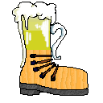
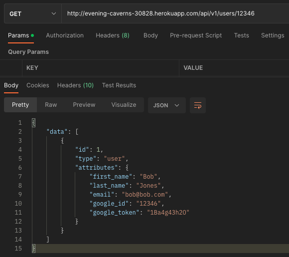
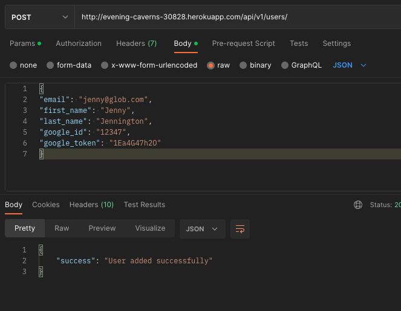
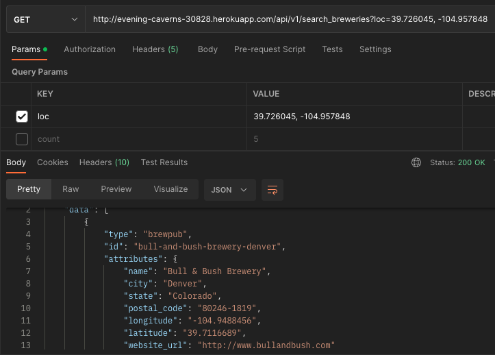
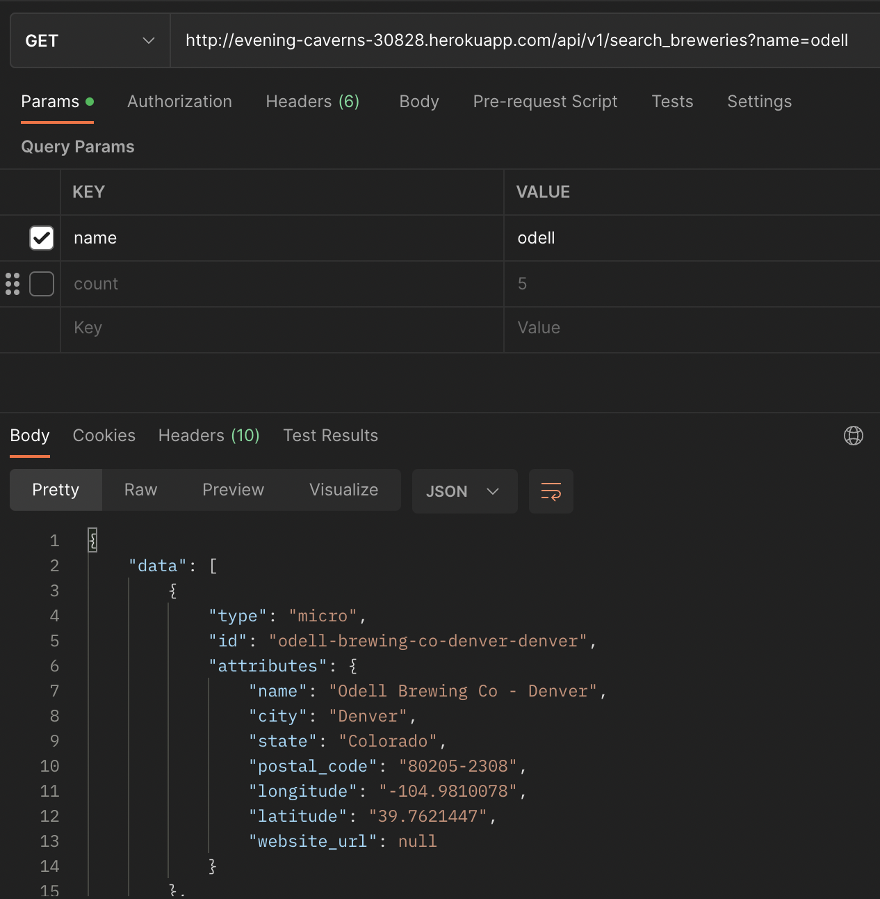
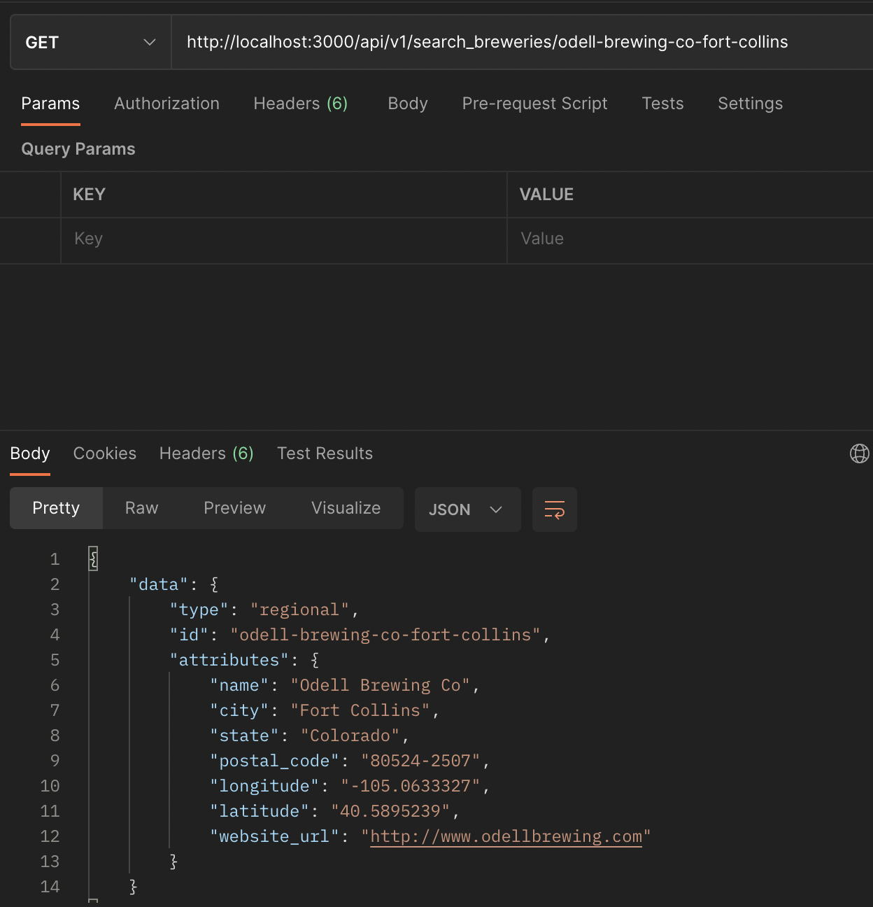
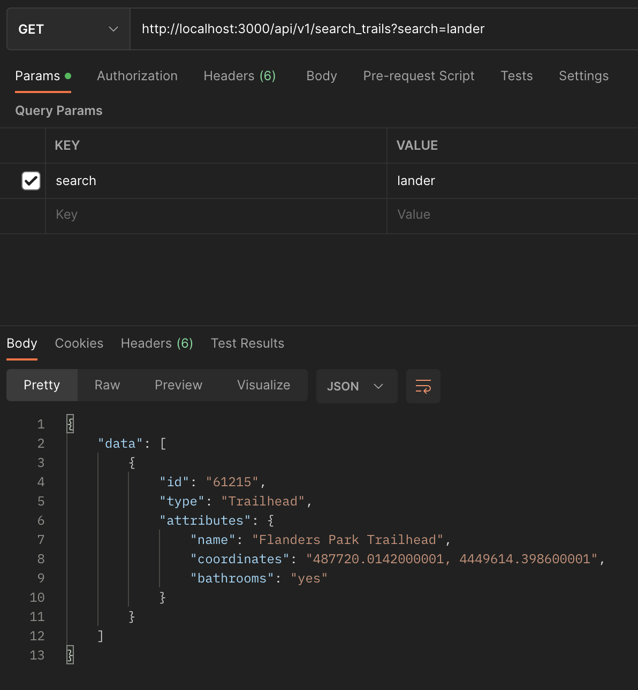
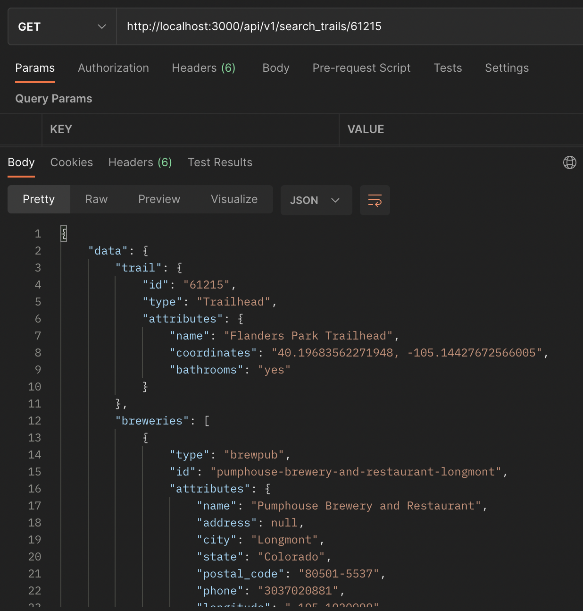

# trails_n_brews_BE

<a name="readme-top"></a>

<!-- PROJECT SHIELDS -->
[![Contributors][contributors-shield]][contributors-url]
[![Forks][forks-shield]][forks-url]
[![Stargazers][stars-shield]][stars-url]
[![Issues][issues-shield]][issues-url]

<!-- PROJECT LOGO -->
<br />
<div align="center">
  <a href="https://github.com/TrailsNBrews/trails_n_brews_BE">
    
  </a>
  <h3 align="center">Trails N Brews, BE</h3>
</div>


<!-- TABLE OF CONTENTS -->
<details>
  <summary>Table of Contents</summary>
  <ol>
    <li>
      <a href="#about-the-project">About The Project</a>
      <ul>
        <li><a href="#learning-goals">Learning Goals</a></li>
        <li><a href="#built-with">Built With</a></li>
      </ul>
    </li>
    <li>
      <a href="#getting-started">Getting Started</a>
      <ul>
        <li><a href="#prerequisites">Prerequisites</a></li>
        <li><a href="#installation">Installation</a></li>
      </ul>
    </li>
    <li>
      <a href="#usage">Usage</a>
      <ul>
        <li><a href="#endpoints">Endpoints</a></li>
      </ul>
    </li>
    <li><a href="#contributing">Contributing</a></li>
    <!-- <li><a href="#license">License</a></li> -->
    <!-- <li><a href="#contact">Contact</a></li> -->
    <!-- <li><a href="#acknowledgments">Acknowledgments</a></li> -->
  </ol>
</details>


<!-- ABOUT THE PROJECT -->
## About The Project

<!-- [![Product Name Screen Shot][product-screenshot]](https://example.com) -->

Trails N' Brews (TnB) is a web app seeking to answer one of life's greatest needs for the Colorado hiker. Whether it be a 1 mile trail along the front range or an expedition to the summit of one this great state's many 14ers all hikers want to know where the nearest brewery is to celebrate and wind down from their achievement. TnB is designed with service oriented architecture.

Trails N' Brews - BE is the back end portion and is in charge of setting the necessary endpoints and services needed by the [FE half](https://github.com/TrailsNBrews/Trails-N-Brews_FE).

<p align="right">(<a href="#readme-top">back to top</a>)</p>

### Learning Goals
Utilize an Agile project management process to hone skill and comfort with building a back end under a service oriented architecture. This will be achieved by consuming the [Open Brewery DB's API](https://www.openbrewerydb.org/) and the [Colorado Trail Explorer (COTREX) data](https://data.colorado.gov/Recreation/Colorado-Trail-Explorer-COTREX-/tsn8-y22x) and exposing them as API endpoints for our front end to call upon. Developers will build experience using Github Projects and the issues features as a project management tool.

<p align="right">(<a href="#readme-top">back to top</a>)</p>

### Built With

* [![Rails]][Rails-url]

<p align="right">(<a href="#readme-top">back to top</a>)</p>


<!-- GETTING STARTED -->
## Getting Started

### Prerequisites

* Ruby 2.7.4
* Rails 5.2.8

### Installation

1. Clone the repo
   ```sh
   git clone https://github.com/TrailsNbrews/trails_n_brews_BE.git
   ```
2. Install gems
   ```sh
   bundle install
   ```
3. Setup db
   ```js
   rails db:{create,migrate}
   ```
4. Run RSpec tests
    ```sh
    bundle exec rspec
    ```

<p align="right">(<a href="#readme-top">back to top</a>)</p>

<!-- ROADMAP -->
## Usage

## Endpoints

- Root directory: 'https://evening-caverns-30828.herokuapp.com/api/v1

- /users
  - GET user, /users/google_id?auth_token=token?auth_val=email
    - Receives the request for the user to log in, authenticates it, and returns the user info.
    - Headers:
      - CONTENT_TYPE => application/json
      - HTTP_AUTH_TOKEN is the google_token
      - HTTP_AUTH_VAL is the user email
      

  - POST user, /users/
    - JSON string in the body with user email, first_name, last_name, google_id, google_token
    - Headers: 
      - CONTENT_TYPE => application/json
      

- /search_breweries
  - Breweries by location
    - GET search_breweries?location="latitude,longitude"
      - Returns the nearest breweries to the location entered
      

  - Breweries by name
    - GET search_breweries?name="name_fragment"&count="number_of_results"
      - Returns breweries in Colorado that closest match the name entered
      

  - Brewery by ID
    - GET search_breweries?id="brewery_id"
      - Returns the exact match for a brewery with that ID
      

- /search_trails
  - Trails by name
    - GET search_trails?search="name_fragment"&count="number_of_results"
      - Returns trails in Colorado that closest match the name entered
      
  - Trail by ID
    - GET search_trails?id="trail_feature_id"
      - Returns the exact match for a trail with that Feature ID
      

See the [open issues](https://github.com/TrailsNbrews/trails_n_brews_BE/issues) for a full list of proposed features (and known issues).

<p align="right">(<a href="#readme-top">back to top</a>)</p>


<!-- CONTRIBUTING -->
## Contributing

Contributions are what make the open source community such an amazing place to learn, inspire, and create. Any contributions you make are **greatly appreciated**.

If you have a suggestion that would make this better, please fork the repo and create a pull request. You can also simply open an issue with the tag "enhancement".
Don't forget to give the project a star! Thanks again!

1. Fork the Project
2. Create your Feature Branch (`git checkout -b feature/AmazingFeature`)
3. Commit your Changes (`git commit -m 'Add some AmazingFeature'`)
4. Push to the Branch (`git push origin feature/AmazingFeature`)
5. Open a Pull Request

<p align="right">(<a href="#readme-top">back to top</a>)</p>


<!-- LICENSE
## License

Distributed under the MIT License. See `LICENSE.txt` for more information.

<p align="right">(<a href="#readme-top">back to top</a>)</p>

 -->

<!-- CONTACT -->
## Developers

1. Brandon Gray, [Github: bGray88](https://github.com/bGray88)
2. Christian McCabe, [Github: cemccabe](https://github.com/cemccabe)
3. Kyle Ledin, [Github: Kledin85](https://github.com/Kledin85)
4. Leo Banos Garcia, [Github: banosl](https://github.com/banosl)
5. Max MacGillivray, [Github: MoxieMax](https://github.com/MoxieMax)
6. Sergio Azcona, [Github: Sergio-Azcona](https://github.com/Sergio-Azcona)

Project Link: [https://github.com/TrailsNbrews/trails_n_brews_BE](https://github.com/TrailsNbrews/trails_n_brews_BE)

## Project Managers/Instructors

1. Meg Stang
2. Mike Dao


<p align="right">(<a href="#readme-top">back to top</a>)</p>


<!-- ACKNOWLEDGMENTS 
## Acknowledgments

* []()
* []()
* []()

<p align="right">(<a href="#readme-top">back to top</a>)</p>
-->


<!-- MARKDOWN LINKS & IMAGES -->
[contributors-shield]: https://img.shields.io/github/contributors/TrailsNBrews/trails_n_brews_BE.svg?style=for-the-badge
[contributors-url]: https://github.com/TrailsNBrews/trails_n_brews_BE/graphs/contributors
[forks-shield]: https://img.shields.io/github/forks/TrailsNBrews/trails_n_brews_BE.svg?style=for-the-badge
[forks-url]: https://github.com/TrailsNBrews/trails_n_brews_BE/network/members
[stars-shield]: https://img.shields.io/github/stars/TrailsNBrews/trails_n_brews_BE.svg?style=for-the-badge
[stars-url]: https://github.com/TrailsNBrews/trails_n_brews_BE/stargazers
[issues-shield]: https://img.shields.io/github/issues/TrailsNBrews/trails_n_brews_BE.svg?style=for-the-badge
[issues-url]: https://github.com/TrailsNBrews/trails_n_brews_BE/issues
[license-shield]: https://img.shields.io/github/license/TrailsNBrews/trails_n_brews_BE.svg?style=for-the-badge
[license-url]: https://github.com/TrailsNBrews/trails_n_brews_BE/blob/master/LICENSE.txt
[linkedin-shield]: https://img.shields.io/badge/-LinkedIn-black.svg?style=for-the-badge&logo=linkedin&colorB=555
[linkedin-url]: https://linkedin.com/in/linkedin_username
[product-screenshot]: images/screenshot.png
[Bootstrap.com]: https://img.shields.io/badge/Bootstrap-563D7C?style=for-the-badge&logo=bootstrap&logoColor=white
[Bootstrap-url]: https://getbootstrap.com
[Rails]: https://img.shields.io/badge/-Ruby%20on%20Rails-CC0000?logo=ruby-on-rails&logoColor=white&style=for-the-badge
[Rails-url]: https://rubyonrails.org 
